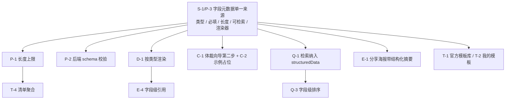

# 结构化帖子优化方案

> 范围：内容结构 / 创建与编辑 / 展示与阅读 / 模板与复用 / 排序与检索 / 互动与分享 / 性能与可访问性
> 性质：**仅方案，不含实现**。每条标注适用场景、优先级、预期收益。
> 依据：全部结论来自当前代码，附 `file:line` 便于核对。

---

## 一、结论摘要：如果只做四件事

| 序号 | 动作 | 为什么是它 |
|---|---|---|
| 1 | **字段定义单一来源化**（字段元数据表驱动，前后端共用） | 其余所有优化都要读/写这些字段，现在每加一个字段要改三处 switch，不改这个后面全是重复劳动 |
| 2 | **详情页按字段类型渲染 + 顶部结论卡** | 结构化目前只是"标签＋文本"，读者拿不到结构带来的任何好处；这是"核心特色"最直观的兑现点 |
| 3 | **structuredData 纳入搜索 + 字段级排序** | 结构化数据的最大红利是"可检索、可排序"，现在这份红利完全没兑现 |
| 4 | **分享海报带结构化摘要** | 分享是增长主渠道，而结构化调性（推荐指数/损失金额）是唯一能自带"有据"气质的分享素材 |

四项之外的模板体系、清单聚合、字段级引用属于第二梯队，依赖第 1 项落地。

---

## 二、现状盘点（可核对）

### 2.1 数据结构

| 事实 | 位置 |
|---|---|
| 体裁 5 种：`review` / `pitfall` / `tutorial` / `debate` / `share` | `models/types.ets:2` |
| 结构化字段共 12 个，**全部声明为 string** | `models/types.ets:29-44` |
| `rating` 声明为 `number \| string` —— 种子数据给 4.5（number），发布页走 TextInput 写入字符串 | `models/types.ets:34`、`backend/prisma/seed-post.ts:50` |
| `steps`（步骤拆解）是**单个字符串**，不是条目数组 | `utils/structuredFields.ets:12` |
| 无字段长度上限、无必填、无类型约束 | `utils/structuredFields.ets` 全文 |
| 后端 `structuredData` 是自由 Json 列，建帖只做 `?? {}` 兜底，**字段层无任何校验**（genre 白名单已有） | `backend/prisma/schema.prisma:60`、`backend/src/services/postService.ts:569-571`；genre 白名单见 `backend/src/routes/posts.ts:112-114` |

### 2.2 读写路径的重复

`utils/structuredFields.ets` 里为同一份字段定义维护了**三处 switch**：

- `readStructuredField`（读，L23-39）
- `withStructuredField`（写，L41-73）
- `withCoverOnlyTextPoster`（整体重建，L75-91）

再加 `pages/DetailPage.ets:83` 的 `readField`（注明是 ArkTS V1 不能变量索引的规避写法）。
**新增一个字段需要同步改 4 处**，漏改不会报错，只会静默丢字段。

### 2.3 发布侧

| 事实 | 位置 |
|---|---|
| 结构化补充区是**可折叠区块，默认收起** | `components/PublishStructuredSupplement.ets:64-107` |
| 输入框 placeholder 直接复用字段中文名（"优点"），无示例 | 同文件 `:32`、`:45` |
| 长字段走 TextArea，短字段走 TextInput，无其它控件 | 同文件 `:31-56` |
| `rating` 用 TextInput 自由输入 | 由 `isLongStructuredField` 决定，`utils/structuredFields.ets:93-97` 未收录 `rating` |
| 4 个发布页（Photo/Text/Video/Preview）各自持有 `sd` 状态与 `buildStructuredData` | `pages/*PublishPage.ets` |

### 2.4 展示侧

| 事实 | 位置 |
|---|---|
| 结构化字段统一渲染成"label 宽 88 + value"两列文本行 | `components/DetailPostContent.ets:181-211` |
| debate 走独立投票面板，方案文字合并进投票行 | 同文件 `:166-179` |
| `buildFields` 只过滤 `undefined / null`，**空字符串会渲染成空行** | `pages/DetailPage.ets:487` |
| 信息流卡片与每日一贴卡面不露任何结构化字段 | `components/PostCard*.ets`、`DailyPostDeck.ets` |

### 2.5 检索 / 分享

| 事实 | 位置 |
|---|---|
| 搜索 WHERE 只覆盖 `title / content / genre / tags` | `backend/src/services/searchService.ts:123-133` |
| 相关度评分同样只算这四项，`genre` 仅 15 分 | 同文件 `:83-111` |
| 无体裁筛选、无字段排序 | `pages/SearchResultPage.ets`、`services/searchService.ts` |
| 分享与海报链路**完全不引用 `structuredData`** | `components/ShareSheet.ets`、`utils/textPoster.ets` 无相关引用 |
| 无任何模板机制 | 全库 `template` 命中均为 Grid `columnsTemplate` |

---

## 三、分维度建议

优先级口径：**高** = 不做的结构化就是假的；**中** = 明显增益但可排后；**低** = 依赖规模或前序能力。

### 3.1 内容结构

| 编号 | 建议 | 适用场景 | 优先级 | 预期收益 |
|---|---|---|---|---|
| S-1 | 用一份**字段元数据定义**替换现有写死结构：每个字段带 `类型 / 必填 / 长度上限 / 是否可检索 / 渲染器`，前后端共用 | 发帖、详情、预览、搜索、分享五处消费 | 高 | 可维护性 + 数据质量：新增字段不再需要改 4 处 switch，且"能不能搜"变成定义的一部分 |
| S-2 | `steps` 由字符串升级为**条目数组**（每条含 小标题 + 说明 + 可选配图 + 可选耗时） | 教程体裁的创作与阅读 | 高 | 阅读体验 + 复用：步骤可编号、可勾选、可计数，也是模板与清单的最小单元；现在整块 TextArea 无法做任何结构化处理 |
| S-3 | 新增跨体裁字段 **`依据/来源`** 与 **`局限与反例`** | 所有体裁 | 高 | 信任：这是"可核验"定位的地基。没有它，结构化字段只是排版，不是可信度 |
| S-4 | 新增 **`一句话结论`**（≤ 40 字，`verdict`） | 详情页顶部、卡面、分享海报三处共用同一句 | 中 | 传播 + 阅读：3 秒判断"要不要读"，分享卡有抓手 |
| S-5 | `rating` 统一为**数值 0-5、步长 0.5**；`lossAmount` 规范为 **数值 + 币种**（可选"血泪指数"档位） | 测评、避坑 | 中 | 检索：只有数值才能排序与聚合（"损失最大"榜、"评分最高"榜） |
| S-6 | `targetAudience` / `tools` 由自由文本升级为 **chip 数组** | 测评、教程 | 中 | 阅读 + 检索：结构化程度提升后可直接做"适合学生党"这类精准命中 |
| S-7 | 体裁扩展（横评对比 / 求推荐 / 证伪补充） | 品类扩展 | 低 | 产品覆盖：**先不做**。字段体系稳定前加体裁会让渲染与校验分叉 |

### 3.2 创建与编辑体验

| 编号 | 建议 | 适用场景 | 优先级 | 预期收益 |
|---|---|---|---|---|
| C-1 | 结构化区从"可选补充（默认收起）"改为**体裁向导的第二步**，选中体裁后直接进入对应字段表单、默认展开 | 发帖主流程 | 高 | 创作效率：核心特色功能藏在折叠里等于没有。默认收起是当前结构化字段覆盖率的最大杀手 |
| C-2 | 每个字段给**示例占位 + 一键套用**（"优点"→ 示例"续航强、系统流畅"） | 所有字段 | 高 | 创作效率 + 数据质量：降低从零写起的门槛，同时把粒度收敛到一致（示例本身就是规约） |
| C-3 | **软校验**：核心字段（测评的 pros/cons、避坑的 correctApproach、教程的 steps）缺失时提示"补全可提升曝光"，**不做硬阻断** | 发帖提交 | 高 | 数据质量：硬必填会显著压低发布率，软引导能在发布率与完整率之间取平衡 |
| C-4 | 字段级**草稿自动保存**（切页、返回、崩溃不丢） | 半途退出的创作 | 中 | 创作效率 + 留存：编辑越重的功能，丢失成本越高 |
| C-5 | 条目化编辑：`steps` / `tools` 支持增删条目、**拖拽排序**、**从剪贴板批量粘贴自动拆条** | 教程类创作者 | 中 | 创作效率：批量粘贴自动拆条是教程作者最痛的一点 |
| C-6 | 4 个发布页的 `sd` 状态与读写收敛为**一个组合式函数 / store** | 4 条发布路径 | 中 | 可维护性：现在每条路径各有一份 `buildStructuredData`，行为漂移风险高 |
| C-7 | 智能预填：从正文抽取候选（正文出现金额→建议填 `lossAmount`，出现工具名→建议填 `tools`） | 长正文发帖 | 低 | 创作效率：依赖字段类型化与语料，S-1/S-5 完成后再做 |

### 3.3 展示与阅读效果

| 编号 | 建议 | 适用场景 | 优先级 | 预期收益 |
|---|---|---|---|---|
| D-1 | **按字段类型分别渲染**，不再是统一两列表：`rating`→星级/环形；`lossAmount`→醒目金额；`steps`→带序号的步骤流；`tools`/`targetAudience`→chip 行；`pros`/`cons`→**左右对照双列** | 详情页全部体裁 | 高 | 阅读体验：`pros/cons` 这种对照信息用表格渲染是最弱形态；结构化字段的视觉价值目前完全没兑现 |
| D-2 | 详情页顶部加 **结论卡**：一句话结论 + 推荐指数 + 适合人群 + 不适合人群 | 测评、避坑 | 高 | 阅读体验 + 信任："先结论后依据"是产品既定调性，也是最省读者时间的一屏 |
| D-3 | 卡面（信息流 / 每日一贴）**露出 1-2 个结构化摘要**（推荐指数、损失金额、"优点 ×3"） | 列表浏览 | 高 | 点击率 + 差异化可见性：现在卡片只有标题与作者，结构化完全不可见，用户没有理由点进来 |
| D-4 | 空态过滤：`buildFields` 补 `raw !== ''` 判断 | 所有帖子 | 中 | 阅读体验：当前空字符串会渲染成只有标签的空行（现存 bug，`DetailPage.ets:487`） |
| D-5 | 长教程（步骤 ≥ 5）加**浮动锚点/跳转** | 教程体裁 | 中 | 阅读完成率：长文的最大流失点是找不到位置 |
| D-6 | 结构化字段**可单独收藏**（收藏"这条帖的避坑清单"而非整帖） | 收藏体系 | 中 | 复用：也是模板体系的前置能力 |
| D-7 | 字段区可按需折叠（默认展开核心字段，`依据/局限`等次要字段收起） | 字段变多之后 | 低 | 阅读体验：预防未来字段膨胀把详情页撑得过长 |

### 3.4 模板与复用

| 编号 | 建议 | 适用场景 | 优先级 | 预期收益 |
|---|---|---|---|---|
| T-1 | **官方模板库**：每体裁 2-3 个骨架（预填示例文本 + 字段提示语），发布时一键套用 | 冷启动与日常发布 | 高 | 创作效率 + 数据质量：既降低门槛，又把"什么是合格的结构化帖子"变成可复制的范式 |
| T-2 | **我的模板**：把自己发过的帖子另存为模板（**只存结构与提示，不存具体内容**） | 连载型 / 系列作者 | 高 | 复用：系列作者的核心诉求，也是内容水位稳定器 |
| T-3 | 草稿箱升级为 **草稿 + 模板双入口** | 草稿箱 | 中 | 复用：现在草稿箱只有草稿，模板无处安放 |
| T-4 | 跨帖**清单聚合**：同体裁结构化字段聚合视图（"所有人的避坑清单"按损失金额排序） | 品类页 / 圈子页 | 中 | 复用 + 检索：把单帖结构化数据变成平台级资产，与 S-5 的数值化强依赖 |
| T-5 | **复制结构**：一键"用同样的结构写一篇"（只复制字段骨架与提示，不含原文） | 看到好帖想跟写 | 中 | 创作效率：需明确边界，只复制结构不复制内容，避免抄袭争议 |
| T-6 | 模板可分享 / 有使用计数 | 社区运营 | 低 | 传播：依赖用户规模，早期收益低 |

### 3.5 排序与检索

| 编号 | 建议 | 适用场景 | 优先级 | 预期收益 |
|---|---|---|---|---|
| Q-1 | **structuredData 纳入搜索**（至少 `targetAudience` / `pros` / `cons` / `tools` / `steps` / `planA` / `planB`） | 搜"学生党 手机"应命中"适合人群：学生党" | 高 | 命中率：结构化内容最有价值的红利，现在完全浪费；实现上先走 MySQL JSON 生成列 + 索引，量级上来再换独立索引 |
| Q-2 | **体裁筛选与分组**（只看避坑 / 只看教程 / 只看横评） | 搜索页、信息流 | 高 | 检索效率：理性内容是任务驱动型消费，体裁是天然的第一层筛选，比关键词更常用 |
| Q-3 | **字段级排序**（推荐指数高→低、损失金额大→小、耗时短→长） | 选购决策、避坑参考 | 高 | 决策效率：这是只有结构化数据才能提供的排序维度，也是与普通内容社区的硬分界 |
| Q-4 | 字段**完整度纳入分发权重**（结构化越完整越容易被推荐） | 推荐算法 | 中 | 供给侧：让"认真填结构"有确定性回报，比任何提示文案都有效 |
| Q-5 | 结构化字段接入**有据指数** | 信任分发 | 中 | 信任 + 分发：产品文档里的核心机制，结构化字段是其最可靠的输入源 |
| Q-6 | 同字段**跨帖对照视图** | 横评场景 | 低 | 决策效率：依赖 S-5 数值化与 T-4 聚合，属于后期形态 |

### 3.6 互动与分享

| 编号 | 建议 | 适用场景 | 优先级 | 预期收益 |
|---|---|---|---|---|
| E-1 | **分享海报带结构化摘要**：按体裁给不同摘要（测评→推荐指数+优缺点各一条；避坑→损失金额+正确做法；教程→步骤数+耗时） | 分享到微信 / 朋友圈 / 微博 | 高 | 传播：分享卡是唯一能自带"有据"调性的载体，现在这份资产完全没利用 |
| E-2 | 结构化字段作为**互动锚点**：可对"缺点"单独回复、对某个步骤提问、对"适合人群"点"我就是" | 详情页评论区 | 中 | 互动深度：把评论从情绪表达拉回依据讨论，这正是产品想做的事 |
| E-3 | 结构化字段挂载**证伪 / 补充入口**（对某字段提交证据） | 有争议的字段 | 中 | 信任机制：字段是证伪的天然挂载点，比整帖申诉精准得多 |
| E-4 | 结构化字段**可被引用**（引用他人帖某字段作为自己帖的依据，形成引用网） | 写帖时引证 | 中 | 信任 + 传播：引用关系网是产品文档里的机制核心，字段级引用比整帖引用信息密度高 |
| E-5 | 收藏粒度细化到字段/清单（同 D-6） | 收藏体系 | 中 | 复用 + 留存 |
| E-6 | 分享卡按体裁切换版式 | 分享 | 中 | 传播：体裁差异化让分享素材更像"刊物"而不是"截图" |

### 3.7 性能与可访问性

| 编号 | 建议 | 适用场景 | 优先级 | 预期收益 |
|---|---|---|---|---|
| P-1 | **字段级长度上限**（长短文本分级，如单项 ≤ 200 字、条目数 ≤ 12） | 输入与入库 | 高 | 性能：直接决定 JSON 体积、海报渲染耗时与列表接口大小；现在完全没有上限 |
| P-2 | 后端补 **structuredData 结构校验**（键白名单 + 长度 + 推荐指数字式），建帖与编辑两条路径都要加 | 建帖 / 改帖接口 | 高 | 健壮性 + 性能：现在任意 JSON 都能入库（genre 白名单已有，缺的是字段层），脏数据一旦进库，后续渲染与检索都要做兼容 |
| P-3 | 前端字段读写**收敛为一份定义**（同 S-1） | 全局 | 高 | 可维护性：消除 4 处 switch 的漏改风险，也让"必填/长度/可检索"有了唯一出处 |
| P-4 | 步骤多（≥ 8）时**分段懒渲染**（折叠"展开全部"） | 长教程详情页 | 中 | 首屏性能：详情页首屏时间直接受影响于字段区高度 |
| P-5 | 长文本**测量结果缓存**（同 `doesTextFitInPoster` 的重复测量问题） | 海报生成、卡片截断 | 中 | 性能：避免逐帧文本测量导致掉帧 |
| P-6 | 可访问性：字段 label 与 value **语义关联**，读屏不读成两段孤立文本 | 详情页字段区 | 中 | 可访问性（WCAG 1.3.1） |
| P-7 | 可访问性：字段对比（优缺点）不只靠颜色区分，补文字/图标标识 | 详情页 | 中 | 可访问性（WCAG 1.4.1） |
| P-8 | 动态字号适配：固定 label 宽 88 在大字号下会挤压 value | 系统大字体 | 中 | 可访问性 + 布局稳健 |

---

## 四、落地顺序与依赖

- **第一批（骨架）**：S-1 / P-3 字段元数据单一来源 → P-1 长度上限 → P-2 后端校验。
  这三项是其余一切的前置；不做就会在后面每个环节重复维护字段定义。
- **第二批（兑现价值）**：D-1 按类型渲染、D-2 结论卡、D-3 卡面摘要、C-1~C-3 发布主路径与软校验、Q-1 检索纳入、E-1 分享摘要。
  这一批做完，"结构化"才从字段变成用户可感知的产品差异。
- **第三批（复用与网络效应）**：T-1/T-2 模板、Q-2/Q-3 筛选与排序、E-2/E-3/E-4 互动锚点与字段级引用。
- **第四批**：T-4 清单聚合、Q-6 跨帖对照、C-7 智能预填——都依赖前序批次的类型化与索引。

---

## 五、需要你决策的三件事

1. **`steps` 字符串 → 数组是否做存量迁移。**
   现网/种子数据里 `steps` 是整块文本。可行路径有两个：直接迁移（一次性脚本按换行拆条，质量不可控）；或新增 `stepsV2` 双写一段时间、渲染优先读数组、旧字段只读兼容。**我倾向后者**，但没有你的环境信息无法判断存量规模。

2. **结构化字段是否设"硬必填"。**
   本方案的立场是**软校验**（C-3）：缺失只提示"补全可提升曝光"，不阻断发布。硬必填能立刻拉高完整率，但会压低发布率——冷启动期发布率更贵。这条需要你拍。

3. **检索实现选型。**
   Q-1 有两条路：MySQL JSON 生成列 + 索引（改动小、与现有 Prisma 一致、量级上限低）；或引入独立倒排（能力上限高、多一套运维）。考虑到你已有"数据量上来再换"的既定判断，本方案默认走前者，但第 4 项 Q-3 的字段排序会加速逼近上限。

---

## 六、风险与取舍

| 风险 | 说明 | 对冲 |
|---|---|---|
| 字段膨胀压垮发布率 | 字段越多，写帖成本越高，冷启动期尤其致命 | 模板库（T-1）+ 示例占位（C-2）+ 软校验（C-3）；新增字段必须同时回答"是否进入模板" |
| `steps` 数组化的兼容成本 | 破坏性变更，涉及渲染、检索、海报三处 | 倾向双写 + 渲染优先新字段，避免一次性迁移 |
| 结构化进入检索后成为刷量目标 | 字段可被灌关键词污染 | 字段长度上限（P-1）+ 字段未填不得分（只有真实填写才算命中）+ 有据指数权重 |
| 字段级引用带来抄袭边界争议 | "引用他人字段"与"抄结构"容易混淆 | 明确规则：引用需署名并回链，复制结构不含内容（T-5） |
| 必填规则前后不一致 | 若前端软校验、后端硬校验，两端行为分叉 | P-2 与 C-3 必须同源（这也是 S-1 单一来源定义要解决问题的延伸） |

---

## 附：本方案未覆盖的部分

- 结构化字段的**审核策略**（哪些字段需要人工/机审）
- 字段与**有据指数**的具体权重公式（属算法设计）
- 结构化数据的**导出与开放**（个人数据可携带、第三方引用）
- 结构化内容的**多端呈现**（平板/车机的字段布局差异）

以上四项建议在第一批落地后单独出方案。
