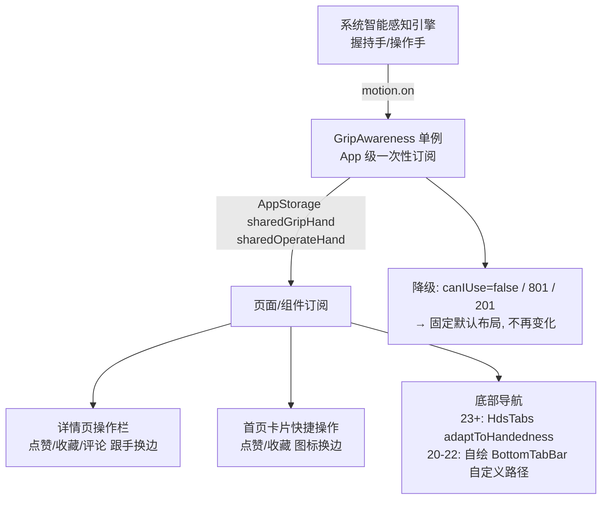

# 「智感握姿」技术分析（有据接入评估）

> 结论先行：**能做，且工程条件恰好满足。** 智感握姿是鸿蒙系统通过多模态感知引擎对外的**姿态信号能力**，
> 应用层不能（也不需要）复刻其识别引擎，只需消费系统暴露的两个抽象信号：
> **握持手**（`holdingHandChanged`，@since 20）与**交互手**（`operatingHandChanged`，@since 15）。
> 有据 `compatibleSdkVersion = 6.0.0(20)`，恰好压在握持手信号的起始版本上——API 20/22/26 全部可用。

---

## 1. 特性是什么

智感握姿是 HarmonyOS 6 引入的交互增强能力（官方内部代号 smart-reachability），
由系统**智能感知引擎**实时识别用户与设备的交互姿态并暴露给应用层，包含两个独立信号：

| 信号 | 含义 | 枚举值 | @since |
|---|---|---|---|
| 握持手 | 设备当前被哪只手**握着** | `NOT_HELD=0`、`LEFT_HAND_HELD=1`、`RIGHT_HAND_HELD=2`、`BOTH_HANDS_HELD=3`、`UNKNOWN_STATUS=16` | **20** |
| 操作手（交互手） | 用户当前用哪只手**在屏上触控** | `UNKNOWN_STATUS=0`、`LEFT_HAND_OPERATED=1`、`RIGHT_HAND_OPERATED=2` | **15** |

官方指标：识别时延 ~100ms，准确率 98%（含单手/双手/横屏等复杂姿态）。
目前 100+ 应用接入（来电横幅、点赞收藏、评论、下单、日程等场景）。

## 2. 能力边界：系统引擎 vs 应用层

```
┌─ 系统层（华为黑盒，三方不可复刻）────────────────────────┐
│ 触控屏传感器（边缘自电容：识别手掌/手指贴边区域）           │
│ + IMU（设备姿态/倾角）+ 近距等辅助传感                    │
│ + 端侧 ML 分类器（NPU/传感器融合，100ms 级响应）           │
│   → 握持手 / 操作手 抽象状态                             │
└──────────────┬───────────────────────────────────────┘
               │ @ohos.multimodalAwareness.motion（系统服务）
               │ 权限：ohos.permission.DETECT_GESTURE
               │ syscap：SystemCapability.MultimodalAwareness.Motion
┌──────────────▼───────────────────────────────────────┐
│ 应用层（我们能做的全部）                                 │
│  motion.on/off + getRecentOperatingHandStatus          │
│  → 状态机（防抖/滞回）→ UI 跟手布局                      │
└──────────────────────────────────────────────────────┘
```

关键边界：**触控屏的边缘自电容数据只上报给系统感知引擎**，三方应用拿不到原始数据，
因此"自研握姿识别引擎"这条路不存在；能做的是消费系统信号 + 做好交互与动效设计。

## 3. API 面板（@kit.MultimodalAwarenessKit → @ohos.multimodalAwareness.motion）

```ts
import { motion } from '@kit.MultimodalAwarenessKit';

motion.on('holdingHandChanged', cb: Callback<motion.HoldingHandStatus>): void;   // @since 20
motion.on('operatingHandChanged', cb: Callback<motion.OperatingHandStatus>): void; // @since 15
motion.getRecentOperatingHandStatus(): motion.OperatingHandStatus;               // @since 15（同步取最新，无需订阅）
motion.off(type, callback?);                                                     // 取消订阅
```

| 项 | 值 |
|---|---|
| 权限 | `ohos.permission.DETECT_GESTURE`（holdingHand 必需）；operatingHand 在 API 20+ 可用 `ACTIVITY_MOTION` **或** `DETECT_GESTURE`，15-19 仅 `ACTIVITY_MOTION` |
| syscap | `SystemCapability.MultimodalAwareness.Motion` → 用 `canIUse()` 做机型探测 |
| 系统开关 | 「设置 > 系统 > 智感握姿」，关闭时事件不产生（应用侧表现为无回调，需按默认布局兜底） |
| 错误码 | 201 权限拒绝 / 401 参数 / **801 能力不支持（核心降级依据）** / 31500001-3 服务异常 |
| 样例工程 | gitcode.com/HarmonyOS_Samples/SmartReach（官方最佳实践源码） |

## 4. 有据的兼容性判定（对照 compatibleSdkVersion = 6.0.0(20)）

| 路径 | @since | API 20 | API 22 | API 26 | 判定 |
|---|---|---|---|---|---|
| `motion.on('holdingHandChanged')` | **20** | ✓ | ✓ | ✓ | **可用，正好压线** |
| `motion.on('operatingHandChanged')` | 15 | ✓ | ✓ | ✓ | 可用 |
| `motion.getRecentOperatingHandStatus()` | 15 | ✓ | ✓ | ✓ | 可用 |
| HdsTabs `barFloatingStyle.adaptToHandedness` | **23** | ✗ | ✗ | ✓ | 仅 API 23+ 分支可用（我们已有 23+ 悬浮分支） |

即：**自定义交互感知方案覆盖全版本（20/22/26），HDS 原生适配只覆盖 23+**。
我们现有的 Index 分支结构（`mainTabsFloating` / `mainTabsPlain`）恰好对应这两条路径，接入点天然分离。

## 5. 接入架构设计



设计要点（对齐华为设计规范）：

- **订阅时机**：EntryAbility/Index 级一次性订阅（不是每页订阅），状态写入 `AppStorage`
  （如 `@StorageLink('gripHand')`），组件侧只做响应式绑定；
- **只订阅一个事件**：跟手布局优先用「握持手」（更稳定，不受触控点漂移影响）；
  「操作手」适合"按钮跟随当前正在操作的手"的进阶场景；
- **防抖/滞回**：握持手在单手切换瞬间可能抖动，需连续 2 次同状态或 300ms 驻留才触发布局迁移，
  避免组件左右横跳；
- **离手/双手保持**：`NOT_HELD` / `BOTH_HANDS_HELD` 不触发迁移，维持上一次状态
  （官方浏览器行为：左手切右手后保持右手状态，离手保持上一手势状态）；
- **降级链**：`canIUse('SystemCapability.MultimodalAwareness.Motion')` 为 false → 默认布局；
  `motion.on` 抛 **801**（设备不支持）→ 默认布局；**201**（权限拒绝）→ 默认布局 + 可选引导；
  系统开关关闭 → 无回调 → 默认布局。四条路都收敛到"不跟手"，功能不缺失。

## 6. 有据的接入点映射（对照华为接入原则）

接入原则：只让「高频且单手难触达」的组件跟手；不迁移低频组件、广告/诱导按钮、
用户正按住的目标；迁移后功能状态行为与原来完全一致。

| 组件 | 高频？ | 单手难触达？ | 建议 | 路径 |
|---|---|---|---|---|
| 详情页底部操作栏（点赞/收藏/评论/分享） | ✓ | ✓（对侧拇指远端） | **首批**：整组平移或对侧新增跟手组 | 自定义（20+） |
| 首页卡片快捷操作（点赞/收藏图标） | ✓ | ✓ | 第二批：图标组换边 | 自定义 |
| 底部导航（HdsTabs 悬浮条） | ✓ | ✓ | `barFloatingStyle.adaptToHandedness: true` 一行 | 组件原生（**23+**） |
| 底部导航（20-22 自绘 BottomTabBar） | ✓ | ✓ | 第三批：BottomTabBar 按握持手镜像 | 自定义 |
| 搜索联想列表 / 发布面板 | 低频 | — | 不接入 | — |
| 搜索结果工具栏 | 中 | 中 | 观察，暂缓 | — |

## 7. 动效与交互规则（华为设计规范硬性要求）

- 组件出场（首次出现）：`interpolatingSpring(velocity 0, mass 1, stiffness 200, damping 17)`
- 侧边绕行（屏外滑出→对侧滑入）：`interpolatingSpring(0, 1, 170, 17)`（更柔）
- 贴边组件**屏外绕行**到对侧；底部/较宽组件**屏内平移**；垂直高度不变、左右边距一致
- 成组组件（工具栏）**整组迁移**，组内顺序与间距不变
- 不要移动用户正按住的目标、不打断进行中的操作、迁移不要过于频繁

## 8. 权限与合规

- `module.json5` 声明 `ohos.permission.DETECT_GESTURE`（`reason` + `usedScene: inuse`）；
- 该权限关联系统开关「智感握姿」：开关关闭时无回调（不报错），应用无需强制引导；
- 隐私说明：应用只获得"左/右/双手"抽象状态，**不涉及原始触控/传感器数据**，隐私说明文案可放心写；
- 红线（华为明示）：露出介绍时必须使用官方名称「智感握姿」，不得自造措辞。

## 9. 分阶段落地计划（建议）

| 阶段 | 内容 | 工作量 | 版本覆盖 |
|---|---|---|---|
| 一 | `GripAwareness` 单例（订阅/防抖/降级/AppStorage 桥） + 权限声明 | ~1 天 | 全版本 |
| 二 | 详情页操作栏跟手（首批高价值场景）+ 动效 | ~1 天 | 全版本 |
| 三 | API 23+ 分支：HdsTabs `adaptToHandedness: true`（一行） | 0.5h | 23+ |
| 四 | 20-22 分支：自绘 BottomTabBar 镜像 + 首页卡片快捷操作 | ~1 天 | 20-22 |

## 10. 系统引擎底层实现推断（非官方，仅供理解）

官方只披露"传感器数据 + 识别算法"。合理推断：

- **操作手**：官方明示"通过触控屏传感器采集触控数据，结合手势识别算法"——
  触控屏边缘自电容可感知悬空手掌/手指贴附区域，结合触点分布与轨迹曲率区分左右手拇指；
- **握持手**：需要更多模态——边缘电容的掌心/四指贴附模式 + IMU 姿态（横竖屏、倾角）
  + （部分机型）侧边指纹/压力等辅助传感，经端侧分类器输出四态；
- 100ms 时延表明推理在常驻的低功耗通路（传感器 hub 或 NPU 轻量模型）上运行，
  且系统已做跨应用仲裁（多个应用订阅共享一份引擎输出，而非各自推理）。

这些对三方不可见、也不可复刻；三方应用的价值在于**把信号翻译成好的跟手交互**。
